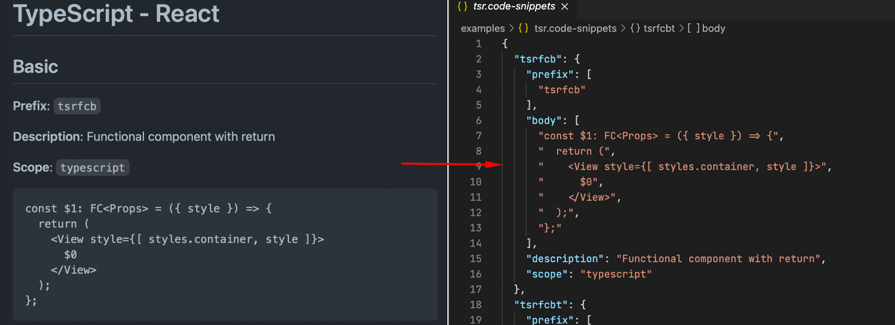
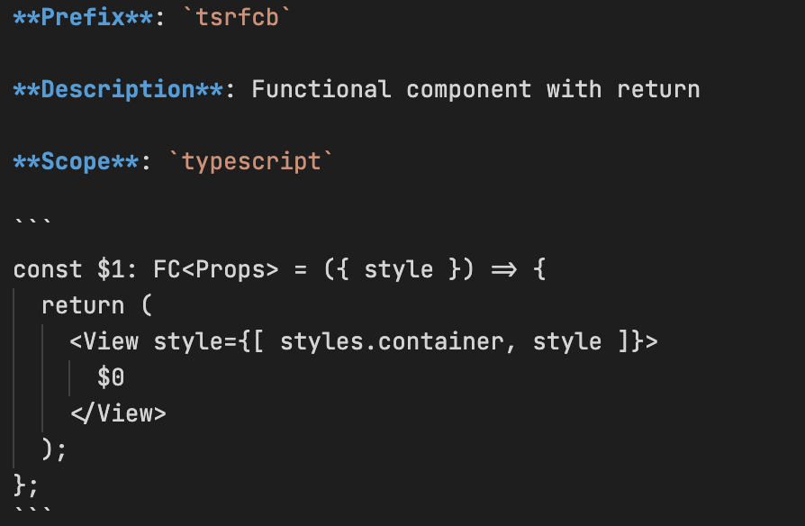

# Markdown to VSCode snippets


Tool for generating VSCode snippets from markdown files.

## Motivation

Snippets are cool! They help to save programmers time and fingers. VSCode is cool too. But it is hard to store, manage and edit multiline snippets. The JSON format is easy. But when you have a lot of snippets with a lot of lines - it is hard to review and edit them. You just don't want to edit snippets cos you will have to have a deal with JSON's array, indents, and correct commas. Over time, you starting to forget snippets and you have to review JSON to recall them. The solution to which I come is to store snippets into readable Markdown and convert it to JSON.



## Installation

```bash
npm isntall -g md2snipp
```

Or use with `npx`:

```bash
npx md2snipp --help
```

## Usage

Create a folder with `.md` files and with the next format:



I usually use `.vscode/snippets` folder for it.

Then run next command:

```bash
npx md2snipp --root .vscode/snippets --output .vscode
```

The tool will look for a `.md` files at `.vscode/snippets`, will convert it to `.code-snippets` files, and will output a result to `.vscode`. It distinguishes separate snippets by the `**Prefix**` keyword and by and of the code block. You can add any other text and comments. The tool will look only for the keywords and snippet's body.

In this example, you are able to keep `.md` files next to the project, share them with teammates, and easily review them right at GitHub.

The tool can also convert separate files:

```bash
npx md2snipp --root .vscode/snippets --output .vscode basic.md
```

Read help for more options:

```bash
npx md2snipp --help
```
